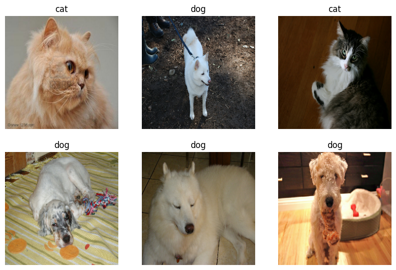
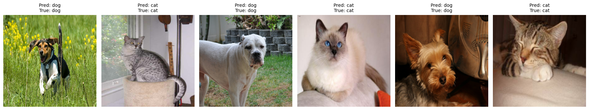
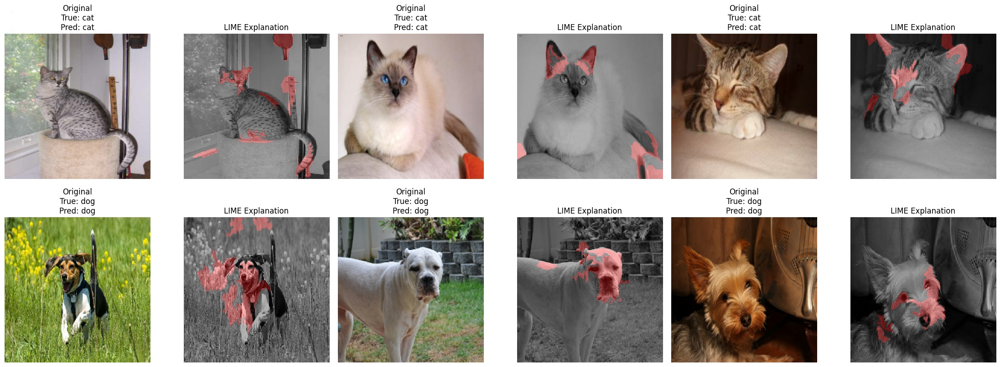
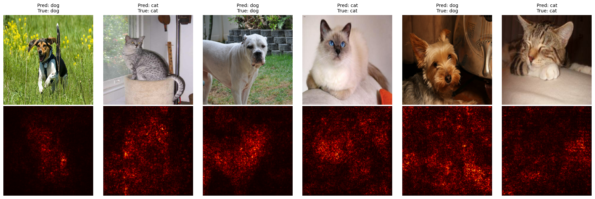
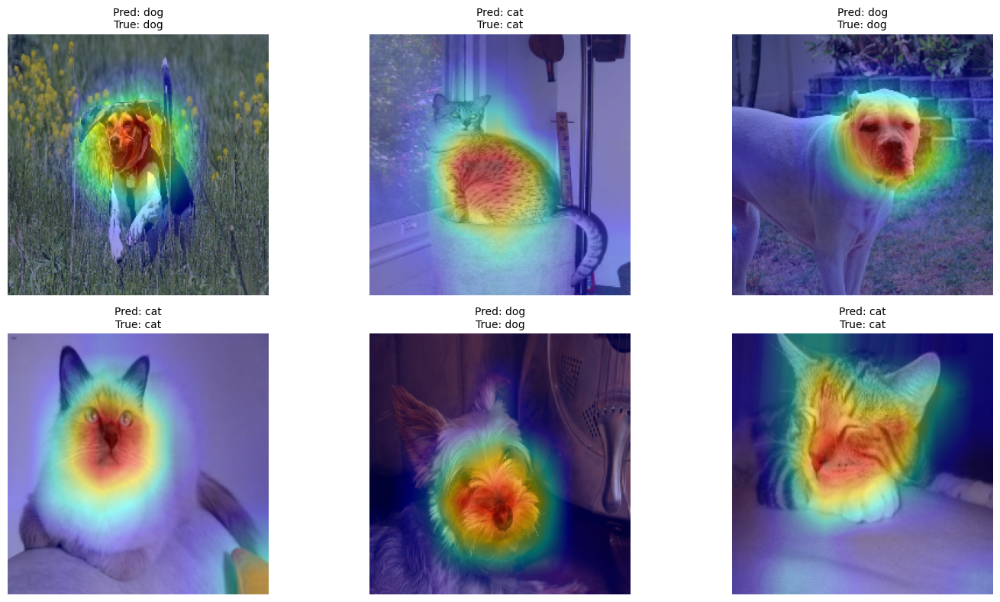
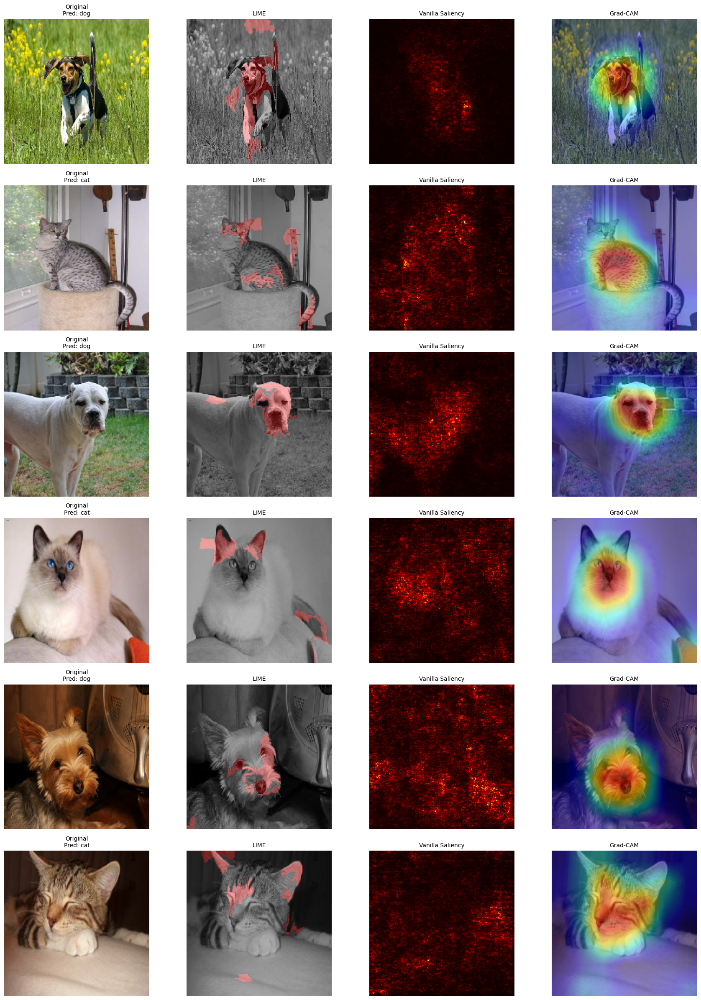

# XAI methods on Cats and Dogs Image Classification Dataset
In this project I applied 3 different Explainable Artificial Intelligence methods to obtain human interpretable explanations for the predition of a black-box model on the image dataset. 

## Dataset
[The Cats and Dogs Classification Dataset](https://xaidataset.github.io/dataset/#cats-and-dogs-classification-(cat&dog-xai)) used in the project is constructed from The Oxford-IIIT Pet Dataset. As stated in the overview section, this binary classification dataset consists of 7390 images across 37 unique categories, each corresponding to different breeds of dogs or cats. Our XAI methods (LIME, Vanilla, GradCam) will try to explain the basis for classifying an image as either a dog or a cat.

## The Model
In this case I'm using the tensorflow's **ResNet50** model which is commonly in use for image datasets. Being considered transformer model, ResNet50 is previously trained on the bigger image dataset, called 'imagenet'. So I tried to fine-tune hyperparametrs of the model. 

Started with dividing our dataset into train and validation sets with the proportion of 80/20% respectively custom layers are added. And some properties of image including height, width are provided. I'll be adding 2 neurons in output layer and using **Softmax** as an activation function as we have a binary classification task. It can be noticed that altough a total number of parametrs is 24,637,826, only 1,050,114 among them can be trained while others are non-trainable parametrs.

One important point is the image shape should be consistent through the model and all XAI methods!

4 epochs were enough to get **98% accuracy** in our Validation dataset. Model's predictions for some random images from each class can be checked. And our XAI methods will be based on the result of these predictions.

In the last preprocessing section I convert the image from a TensorFlow tensor to a NumPy array, then verify if pixel values are in the 0–255 range. If so, it scales them to 0–1 as expected by the model. It's important because:

  -  ResNet50 expects input pixel values in the range [0, 1]. Feeding unnormalized data (e.g., 0–255) can lead to incorrect predictions
  -  Prevents unexpected behavior during inference or visualization caused by out-of-range pixel values
  -  Ensures all images are on the same scale, which improves model stability and accuracy.
    
## LIME
I started my XAI methods with LIME technique to understand which regions of an image influence the model’s classification decision.

  -  A classifier_fn is defined to preprocess images and return predictions from the trained ResNet50 model
  -  Image segmentation is done using the slic algorithm for superpixel generation
  -  Each image is passed to the LimeImageExplainer to generate an explanation. The explanation highlights regions (superpixels) most important (10 features in this case) for the predicted       class
    

### Observation: 
In the left: The original image with predicted and true labels. In the Right: An overlaid LIME mask showing the most influential regions for the prediction.

For dogs the model primarily focuses on the nose, forehead, neck and surrounding region while for cats the area below the Ears, whiskers and tail are emphasized.

## Vanilla Saliency Map
Now I implement GradientTape class from Tensorflow for explanation of the model's prediction using Vanilla Saliency Map. For each selected image, it's expected to:

  -  Predict its class with the trained resnet_model
  -  Use tf.GradientTape() to compute the gradient of the output class score with respect to each input pixel
  -  Take the maximum absolute gradient across RGB channels to generate a 2D saliency map

### Observation: 
The saliency maps highlight important regions of the image like dog's nose and cat's head that influence the model’s prediction. It's also understandable for human interpration. However, some noisy parts are also observed — especially when the main object’s color is similar to the background, making it harder for the gradients to isolate distinct features

## Gard-CAM
And finally to implement Grad-CAM method I followed these steps:

  *  Create sub-model() Outputs activations from the last conv layer and final predictions
  *  Use GradientTape that tracks input to compute gradient of the target class score w.r.t. conv layer output
  *  Generate class activation map (CAM): Weighted sum of feature maps, followed by ReLU
  *  Normalize and resize CAM: Scale to [0, 1], resize to input image size (224×224).

### Observation: 
It's emphasising on mostly important parts such as whiskers, striped body parts in cats and nose, mouth, and head area in dogs. The explanatory parts on both classes are similar to each other but in more human-interpretable form at the same time

## Comparison
Out of 3 XAI methods Grad-CAM looks more promising. Here's some reasons:

  -  Localized Attention: Clearly highlights the discriminative regions (face or body of the pet), making the model’s reasoning intuitive
  -  Human-Interpretable Heatmaps: It generated smooth, colorful overlays that are easy to understand, even for non-technical audiences
  -  Consistent Across Samples: Unlike LIME and saliency, Grad-CAM is less sensetive to the noise
  -  Model aware: Grad-CAM uses internal convolutional feature maps and gradients, making it more faithful to our actual prediction model

 

## References
  *  For the classifiaction model RestNet50 this [github](https://github.com/nachi-hebbar/Transfer-Learning-ResNet-Keras) repository is used
  *  Weekly exercises from XAI course
  *  TensorFlow Developers. An end-to-end open-source machine learning platform. [Website](https://www.tensorflow.org/)
  *  Grad-CAM: Visual Explanations from Deep Networks via Gradient-based Localization. Proceedings of the IEEE International Conference on Computer Vision (ICCV). [Paper Link](https://arxiv.org/abs/1610.02391)
